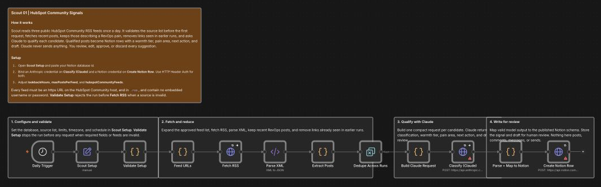

# Scout

Turn HubSpot Community questions into prioritized RevOps follow-up.

Scout is a set of six n8n workflows. Once a day it reads three public HubSpot
Community RSS feeds, keeps the posts that describe a RevOps problem, asks Claude
to qualify each one, and files it in a Notion signal map with a warmth tier, a
pain area, a next action, and a draft reply for you to review.

No outreach is sent. Every draft sits in Notion until you decide what to do with
it. The only email Scout sends is a digest to your own address.

## What Scout does

A HubSpot Community post is not a lead. It is a person describing a broken
lifecycle sync at eleven at night. Scout's job is to notice that post, tell you
why it matters, and hand you an opening line, so triage stops being a browser
tab you never open.

Concretely, Scout:

- reads three public HubSpot Community RSS feeds on a schedule you control;
- drops posts older than your lookback window and posts that mention no RevOps
  keyword, before any model sees them;
- asks Claude to classify the survivors into a warmth tier, a persona, a track,
  a pain area, and a suggested angle;
- writes each qualified post to a Notion database as one row, with `Next action`
  set to `Comment`, which the workflow assigns after qualification rather than
  asking the model to pick;
- drafts a comment and stores it in that row, ready for you to edit;
- emails you when open rows go quiet, and once a week with a scorecard.

Scout does not log in to any community, does not read member profiles, does not
collect email addresses, and does not post, comment, connect, or message anyone.
It writes suggestions to your Notion database and email to your own inbox.

Notion holds the signal map. n8n holds deduplication state, and depending on
your instance's execution-data settings it may also retain the inputs and
outputs of each run. Set your execution saving and pruning policy before you
activate anything. See
[docs/architecture.md](docs/architecture.md#storage-and-retention).


The diagram shows where the trust boundary is. Everything above the dashed line
is Scout preparing work. Everything below it is you deciding. The only mail
Scout sends is the digest, and it goes to the one address you configure.

## Quickstart

The first workflow is the whole loop on its own. The other five are optional and
can be added later. Workflow 01 has been run end to end on a disposable n8n
`2.36.8` instance, so steps 3 through 7 are a recorded result rather than a
plan. Steps 9 through 11, which cover retention and activation, have not been
exercised: nothing has been put on a schedule.
[docs/live-verification.md](docs/live-verification.md) records exactly what was
and was not run.

1. **Create the Notion database.** Follow [docs/notion-schema.md](docs/notion-schema.md)
   and create every property with the exact name, type, and options listed
   there. Scout writes by property name, so a rename breaks the write.
2. **Create the credentials in n8n.** One HTTP Header Auth credential for
   Anthropic and one for Notion. [docs/setup.md](docs/setup.md) gives the exact
   header names. Tokens belong in n8n's credential store, never in a workflow.
3. **Import the workflow.** In n8n, import
   `workflows/core/01-hubspot-community-signals.json`. It arrives inactive with
   no credentials bound.
4. **Edit `Scout Setup`.** Paste your Notion database id. Adjust
   `anthropicModel`, `lookbackHours`, `maxPostsPerFeed`, and the feed list if you
   want to. Every field is a plain value on one node.
5. **Bind the credentials.** Attach the Anthropic credential to
   `Classify (Claude)` and the Notion credential to `Create Notion Row`.
6. **Run it manually, with the schedule still off.** Use n8n's manual execution.
   Nothing about this workflow depends on the schedule being on.
7. **Check what landed in Notion.** Open the database. Confirm the rows have a
   warmth tier, a pain area, a next action, and a source link that opens the post
   you expected.
8. **Read the generated text before you trust it.** Open a few `Draft` values and
   decide whether you would actually send them. Tune the prompt in
   `Build Claude Request` if the voice is wrong.
9. **Review your n8n execution-data settings.** n8n can retain the inputs and
   outputs of every run, which here would include post content, prompts, model
   responses, and Notion data. Decide what your instance saves and how it prunes
   before you put this on a schedule.
   [docs/setup.md](docs/setup.md) links the n8n documentation for both.
10. **Set the workflow timezone and the schedule.** The workflow ships pinned to
    UTC so the cron expression is unambiguous. Change it to your timezone in
    workflow settings, then set the hour you want.
11. **Activate it deliberately.** Turn the schedule on only once steps 7 and 8
    gave you output you were happy with.

## How the six workflows fit together

The first workflow is the loop. Everything else feeds it or reads from it.

| File | Name | Role |
| --- | --- | --- |
| `workflows/core/01-hubspot-community-signals.json` | Scout 01 \| HubSpot Community Signals | Fetch, deduplicate, classify, draft, write to Notion |
| `workflows/core/02-manual-signal-intake.json` | Scout 02 \| Manual Signal Intake | Capture a signal you found yourself, through an n8n form |
| `workflows/core/03-stale-signal-nudge.json` | Scout 03 \| Stale Signal Nudge | Email you the open rows that have gone quiet |
| `workflows/extensions/04-community-engagement-sync.json` | Scout 04 \| Community Engagement Sync | Advance a row when a community notification says someone replied |
| `workflows/extensions/05-draft-backfill.json` | Scout 05 \| Draft Backfill | Fill in drafts for open rows that do not have one |
| `workflows/extensions/06-weekly-scorecard.json` | Scout 06 \| Weekly Scorecard | Email a Friday summary against targets you set |



That is workflow 01 exactly as it imports: one linear chain, inactive, with no
credentials bound. The two warning markers are n8n pointing out the credentials
you have not attached yet, which is what a credential-free template should look
like on arrival.

The three core workflows are the ones most people will use. The three
extensions become useful once the board has enough rows to be worth maintaining.

Per-workflow triggers, setup keys, credentials, failure behavior, and known
limits are in [docs/workflow-reference.md](docs/workflow-reference.md). Data
movement and trust boundaries are in
[docs/architecture.md](docs/architecture.md).

## Requirements

- **n8n.** Built for n8n `2.36.8` using built-in nodes only. No community nodes.
- **Notion.** An internal integration and one database created from
  [docs/notion-schema.md](docs/notion-schema.md).
- **Anthropic.** An API key. The default model is `claude-haiku-4-5-20251001`,
  chosen to keep classification cheap; change it in `Scout Setup`.
- **Gmail.** Only for the workflows that send you email or read your community
  notifications. The other three do not need it.
- **Node.js `22.22.x`.** Only to run this repository's own tests. n8n does not
  need it.

Running Scout costs whatever your Anthropic usage costs. Workflow 01 processes
at most `feed count` times `maxPostsPerFeed` candidate items per run, and
workflow 05 at most `batchSize` rows. Both ship at `5`, so the defaults are 15
candidates across the three shipped feeds and 5 rows. Each item normally
produces one Anthropic request.

Five is a conservative shipping default, not a verified volume: the one recorded
live run used `maxPostsPerFeed: 1` and `batchSize: 2`, and nothing has been
observed at 5. On a first run, use those lower numbers.

Those settings control volume, not billing. The shipped model nodes use
`retryOnFail: true` with `maxTries: 3`, so a transient failure can turn one item
into up to three API attempts. Treat the caps as a volume dial and set a usage
limit or spend alert in your Anthropic account as the actual guard.

## Human review and source limits

Scout produces recommendations. It is not an outreach robot and is deliberately
missing the parts that would make it one.

- **Automated discovery is HubSpot Community RSS and nothing else.** The feed
  list is validated before the first request: https only, the HubSpot Community
  host exactly, a `.rss` path, no embedded credentials. Pointing Scout at another
  site is a configuration error that stops the run.
- **Manual intake accepts a URL you supply yourself.** The `Source` dropdown
  includes labels like LinkedIn and Reddit because you can tell Scout where
  *you* saw something. Scout does not fetch those platforms. The `LinkedIn URL`
  property is stored and never retrieved.
- **No outreach is sent.** No workflow posts, comments, connects, or messages
  anyone in the signal map. Workflows 03 and 06 do send email, but only a digest
  to the single address you configure, and that address is validated before
  Gmail is asked to send.
- **Drafts are drafts.** Scout writes them to Notion. A human decides whether
  they are worth sending, and edits them first.
- **Volume stays low on purpose.** Three feeds, once a day, unauthenticated.

RSS being available is a technical interface, not permission for any downstream
use. You are responsible for the platform terms, privacy rules, and outreach
rules that apply to you. Read [docs/source-policy.md](docs/source-policy.md)
before you point this at anything, including
[Scope, and what could carry over](docs/source-policy.md#scope-and-what-could-carry-over)
on how far the pattern travels and what a new source would require.

## Scope and extension

Scout v0.1 intentionally supports HubSpot Community RSS and a RevOps signal
schema. It is not a generic scraper and does not claim support for arbitrary
communities.

What could carry over to another source is the shape of the system, not its
code: intake, qualification, signal mapping, and human-reviewed action. A source
such as GitHub issues or n8n discussions would need its own workflow, its own
parsing and validation, and its own access-policy review before anything is
written.

None of that exists here. Adding a feed URL from somewhere else is a
configuration error the validator rejects before the first request. The fuller
statement is in
[Scope, and what could carry over](docs/source-policy.md#scope-and-what-could-carry-over).

## Verification status

This v0.1.1 snapshot has bounded verification. Some of it has been
checked against live services and some of it has not, so the table below
separates the two. A row marked as verified was observed; a row marked as not
verified has never been run, and no verified row stands in for it. Releasing it
did not verify anything further.

| Claim | Status |
| --- | --- |
| Workflow JSON passes this repository's structure validator | Checked by `npm run validate` |
| Workflow JSON carries no credentials or private identifiers | Checked by `npm run scan` |
| Code node behavior matches the documented behavior | Checked by `npm test` against synthetic fixtures |
| A fresh n8n `2.36.8` instance accepts the workflow JSON | Verified for all six over `POST /rest/workflows`, with a round-trip showing no drift |
| Import through the Editor UI in a browser | Verified for Workflow 01 on v0.1.1; not separately tested for workflows 02 through 06 |
| Live run against HubSpot Community RSS, Notion, and Anthropic | Verified once, for workflows 01, 02, and 05 |
| Computed digest content for workflows 03 and 06 | Verified, with nothing sent |
| Live email delivery, and workflow 04's Gmail trigger | Not yet verified |
| Cost per run | Not measured |

Setup time has not been measured either, so this README does not promise one.

Set Scout up with **Import from File** in the Editor UI. The `n8n
import:workflow` CLI cannot read these files, because it requires a top-level
workflow id that a public export should not carry. The reasoning, the
workaround, and the exact limits of what was tested are in
[docs/live-verification.md](docs/live-verification.md).

## Repository layout

- `workflows/`: the six exported workflows, inactive and credential-free.
- `docs/`: setup, schema, architecture, source policy, and reasoning.
- `assets/`: the architecture diagram and the workflow 01 canvas screenshot.
- `examples/fixtures/`: synthetic inputs the tests run against. See
  [examples/README.md](examples/README.md).
- `scripts/`: the sanitizer, the structure validator, and the safety scanner.
- `tests/`: behavior tests for the Code nodes and for this documentation.

```bash
npm run check   # tests, then structure validation, then the safety scan
```

## Reading order

- [docs/setup.md](docs/setup.md): get it running.
- [docs/notion-schema.md](docs/notion-schema.md): the exact database.
- [docs/workflow-reference.md](docs/workflow-reference.md): what each workflow does.
- [docs/architecture.md](docs/architecture.md): how data moves, where it stops, and what is retained.
- [docs/source-policy.md](docs/source-policy.md): what Scout is allowed to read.
- [docs/decision-log.md](docs/decision-log.md): why it is built this way.
- [CONTRIBUTING.md](CONTRIBUTING.md): how to file a useful issue safely.
- [SECURITY.md](SECURITY.md): how to report something sensitive.
- [CHANGELOG.md](CHANGELOG.md): what changed.

## License

MIT. See [LICENSE](LICENSE).

The private operational workflows this project was derived from are not part of
this repository and never enter its history.
